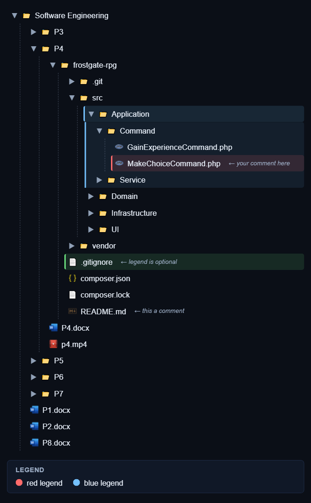
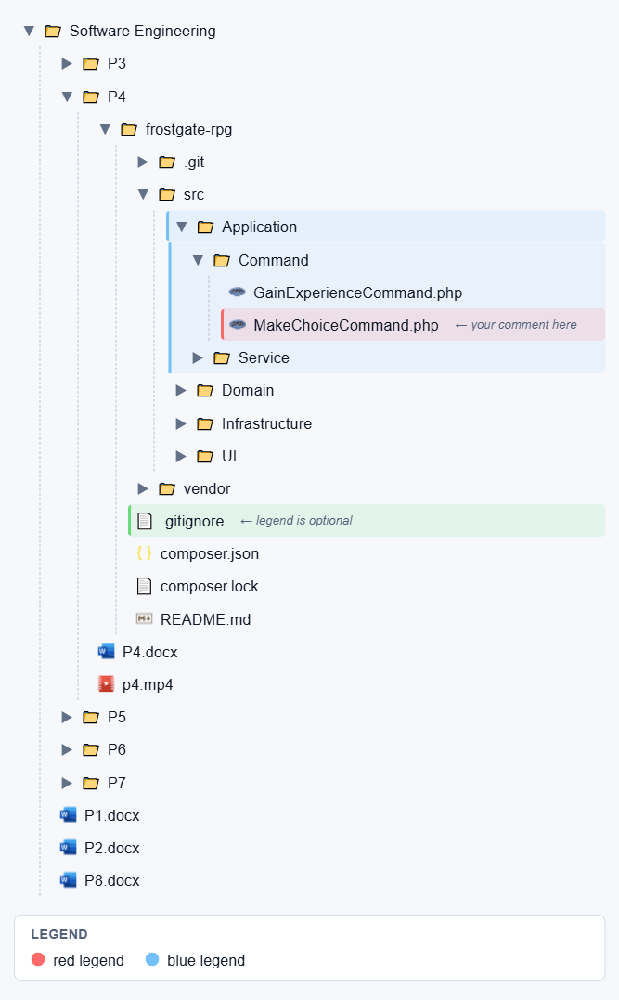
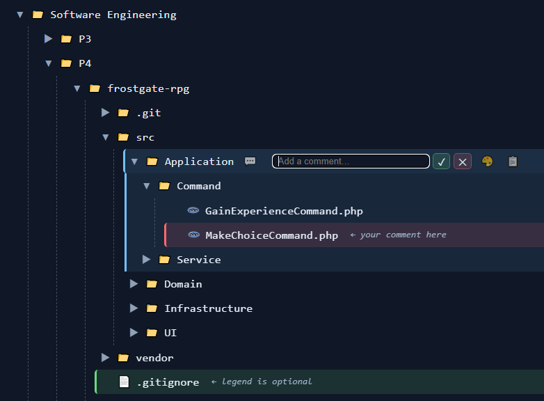
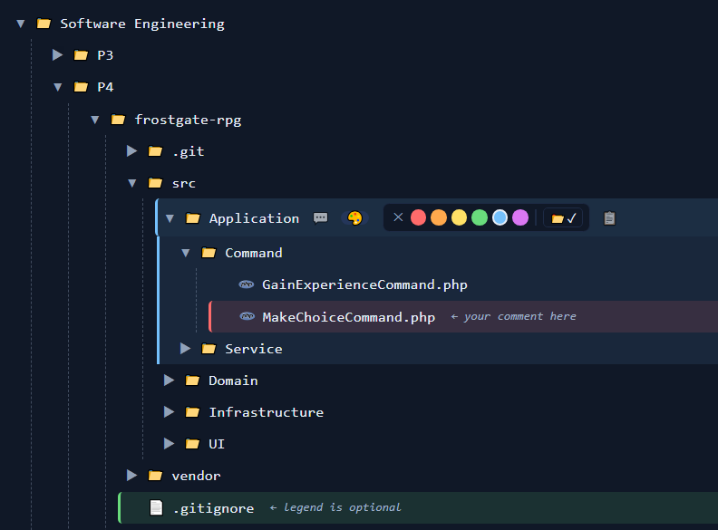
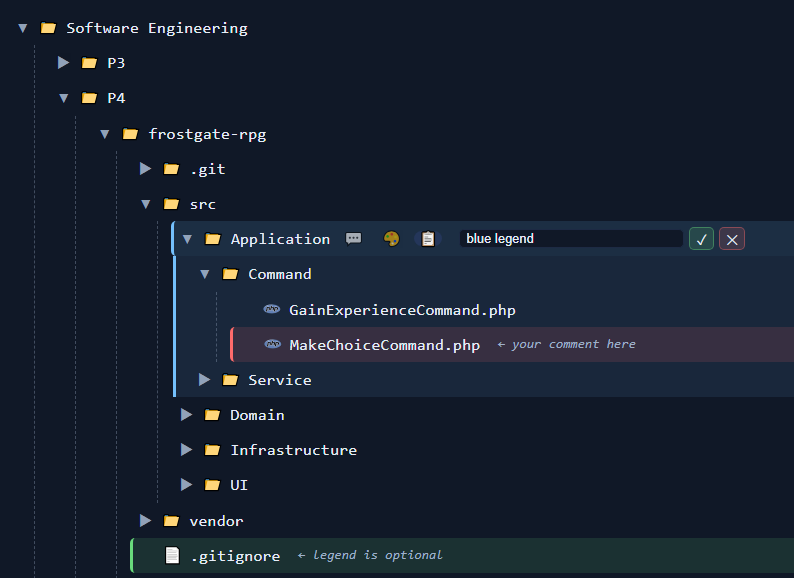
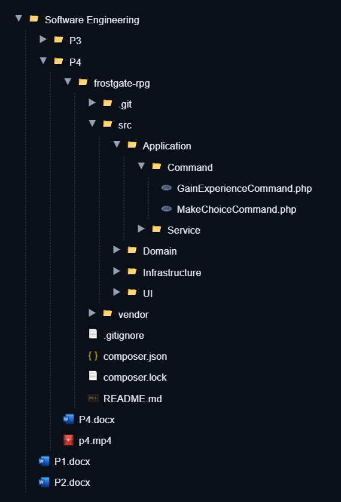
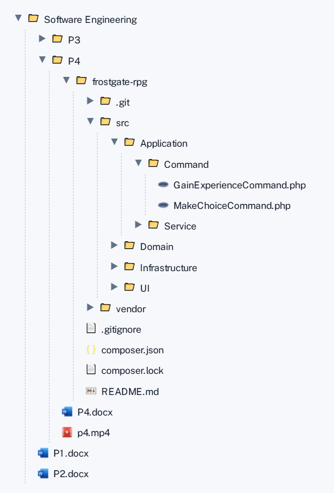
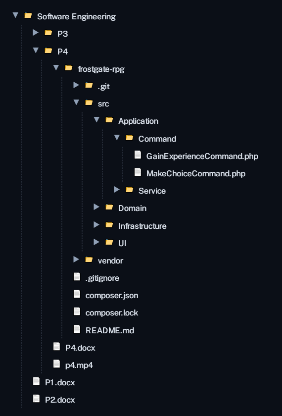
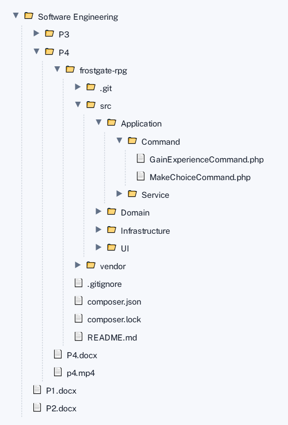

# Structure Viewer

A lightweight, browser-based tool for visualizing **folder structures**, **JSON data**, and **public GitHub repositories** as an interactive tree — with optional advanced file-type icons, inline annotations, color highlights, and PNG export.

Built to be fast, privacy-friendly, and dependency-light.  
Runs entirely in the browser. No uploads. No servers.

---

## ✨ Features

### 📁 Folder Tree Viewer

- Pick a local folder using the **File System Access API**
- Lazy-loads subfolders for performance
- Expand / collapse individual nodes or the entire tree
- Alphabetical ordering (folders first)

> Requires Chromium-based browsers (Chrome, Edge)

---

### 🗜️ ZIP Archive Viewer

- Load and explore `.zip` files without extracting them
- Displays the complete folder structure instantly
- View nested directories and all contained files
- Works in all modern browsers
- Perfect for inspecting archives before extraction

---

### 🧾 JSON Tree Viewer

- Load any `.json` file locally
- Smart labeling for array items using priority fields:
  - `name`, `username`, `title`, `id`
- Clean, readable tree structure
- Handles deeply nested data safely

---

### 🌍 GitHub Repository Viewer (Public Repos)

- Load the folder structure of **public GitHub repositories**
- Enter `owner/repo` (optionally a branch name)
- Uses the GitHub REST API to fetch the repository tree
- Fully read-only — no authentication required

**Notes:**

- Only public repositories are supported
- Very large repositories may load slowly
- GitHub API rate limits may apply

This mode is useful for quickly inspecting project layouts without cloning anything locally.

---

### 💬 Comments

- Hover any node and click **💬** to add a short inline annotation
- Comment appears next to the label as `← your note`
- Click **💬** again to edit or close the editor
- Press `Enter` to save, `Escape` to cancel
- Comments are included in PNG exports
- Persisted in `localStorage` — survive page reloads
- Clear all comments at once with the **🗑 Comments** button in the tree panel header

---

### 🎨 Color Highlights

- Hover any node and click **🎨** to open the color palette
- Choose from 6 colors to highlight the row with a tinted background and left border
- For **folder nodes**, use the **📂** button inside the palette to extend the highlight to all folder contents
- Changing a folder's color while the folder highlight is active **automatically updates both** the row and its contents
- Highlights are included in PNG exports
- Persisted in `localStorage` — survive page reloads
- Clear all highlights at once with the **🗑 Colors** button in the tree panel header

---

### 📋 Legend

- Once a node is colored, hover it and click **📋** to attach a text label to that color
- Labels are **shared across all nodes using the same color** — set once, applies everywhere
- Each label must be unique across colors (duplicates are blocked with a validation error)
- The legend renders live **below the tree** as a colored-dot reference panel — hidden when no data is loaded
- The legend is included as a **separate section** in PNG exports
- Persisted in `localStorage` — survives page reloads
- Use **🗑 Legend** to clear only the labels while keeping color highlights visible
- Use **🗑 Colors** to clear both highlights and legend labels at once

---

### 🗑 Clearing Annotations

Three dedicated buttons sit in the tree panel header:

| Button          | What it clears                           | Keeps            |
| --------------- | ---------------------------------------- | ---------------- |
| **🗑 Colors**   | All color highlights + all legend labels | Comments         |
| **🗑 Legend**   | All legend labels only                   | Colors, comments |
| **🗑 Comments** | All inline comments                      | Colors, legend   |

All three actions also wipe the corresponding `localStorage` entries — cleared data does not come back on reload.

---

### 🖼️ Annotations & Legend Examples

| Dark theme                                                                                                  | Light theme                                                                                                   |
| ----------------------------------------------------------------------------------------------------------- | ------------------------------------------------------------------------------------------------------------- |
|  |  |

Both images show comments, color highlights, folder highlights, and the legend panel together.

---

### Feature Close-ups

| 💬 Comments                                                                                      | 🎨 Color highlights                                                                       | 📋 Legend                                                                         |
| ------------------------------------------------------------------------------------------------ | ----------------------------------------------------------------------------------------- | --------------------------------------------------------------------------------- |
|  |  |  |

---

### 🎨 Themes

- **System**, **Dark**, and **Light** themes
- Theme-aware PNG export
- Theme preference stored locally

---

### 🖼️ PNG Export

- **Export View** – exports exactly what's expanded
- **Export Full** – auto-expands everything before export
- Optional background (transparent or theme-colored)
- Export width auto-fits to content
- Icons are rasterized safely for reliable exports
- Action buttons, input boxes, and palettes are **never included** in exports
- Legend section is appended automatically if labels are defined

---

## 🖼️ Export Examples

The tool supports exporting the tree view to PNG with different themes and icon modes.

Below are example exports showing the available combinations.

### Advanced Icons Enabled

| Dark theme                                                                               | Light theme                                                                                |
| ---------------------------------------------------------------------------------------- | ------------------------------------------------------------------------------------------ |
|  |  |

---

### Generic Icons (Advanced Icons Disabled)

| Dark theme                                                                     | Light theme                                                                      |
| ------------------------------------------------------------------------------ | -------------------------------------------------------------------------------- |
|  |  |

---

### Export Notes

- Export width automatically fits the visible content
- Icons are rasterized for reliable, crisp output
- **Export View** captures only expanded nodes
- **Export Full** temporarily expands the entire tree
- Color highlights, comments, and legend are all included in exports

---

### 🧠 Advanced File Icons (Optional)

- Toggleable "Advanced Icons" mode
- Loads official file-type icons (based on VS Code icon set)
- Supports many formats:
  - Code: `.js`, `.ts`, `.cs`, `.java`, `.py`, `.cpp`, …
  - Media: `.mp3`, `.mp4`, `.png`, `.svg`, …
  - Docs: `.pdf`, `.docx`, `.pptx`, `.xlsx`, …
  - Archives, fonts, binaries, configs, and more
- Icons are cached locally for performance
- Falls back gracefully to emojis if unavailable

---

## 🔐 Privacy & Security

- **Nothing is uploaded**
- Files and folders are accessed only via browser APIs
- No data leaves your machine
- No analytics, tracking, or background requests (except optional icon fetching)

This tool is safe to use with sensitive local data.

---

## 🌐 Browser Support

| Feature        | Support             |
| -------------- | ------------------- |
| Folder picker  | Chrome, Edge        |
| ZIP viewer     | All modern browsers |
| JSON viewer    | All modern browsers |
| PNG export     | All modern browsers |
| Advanced icons | All modern browsers |
| Comments       | All modern browsers |
| Highlights     | All modern browsers |
| Legend         | All modern browsers |

---

## 🚀 Usage

### Online (GitHub Pages)

1. Open the hosted page
2. Click **Pick Folder**, **Pick JSON**, or load a **ZIP / GitHub repo**
3. Explore the tree
4. Optionally annotate with comments, colors, and legend labels
5. Export if needed

### Local

```bash
git clone <repo-url>
cd structure-viewer
open index.html
```

No build step required.

## 🛠️ Tech Stack

- Vanilla HTML / CSS / JavaScript
- html2canvas for PNG export
- File System Access API (Chromium)
- Bootstrap Icons (UI chrome)
- Zero frameworks

Designed to run well even on older or low-powered machines.

## ⭐ Notes

This project was built with a strong focus on:

- Simplicity
- Performance
- Correct exports
- Predictable behavior

If something looks boring in the code — it's probably intentional 🙂

## ❤️ Acknowledgements

- File-type icons inspired by the VS Code icon ecosystem
- Thanks to browser vendors for finally making local file access usable

---

☕ If this tool saves you time, consider [supporting on Ko-fi](https://ko-fi.com/smurf11k)

---

Enjoy exploring your data 🌲
